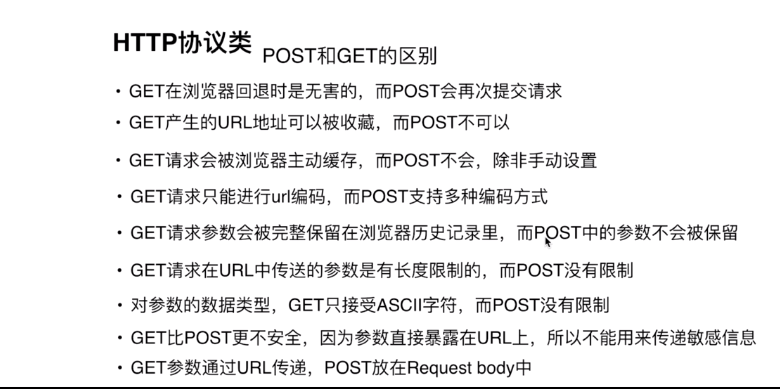
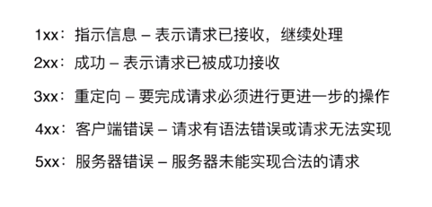
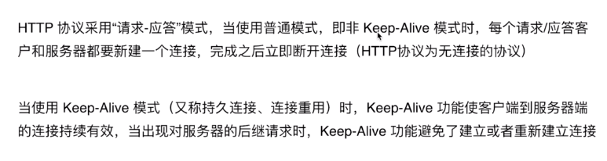
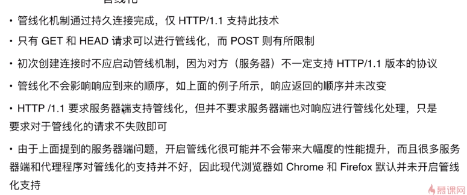

1. http协议的主要特点

    简单快速
    灵活
    无连接 （链接一次就会断掉、不会保持链接）
        采用这种方式可以节省传输时间
    无状态

2. http报文的组成部分

    请求报文 
        请求行
        请求头
        空行
        请求体

    响应报文
        状态行
        相应行
        空行
        响应体

3. http方法

    get
    post
    put
    delete
    head

4. post和get区别
    

5. http状态码
    
    

6. 什么是持久连接
    

7.  什么是管线化
    